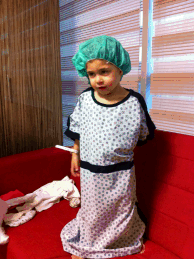

---
authors:
  - serdar

title: "A \"Storm is over\" post with an early birthday of my blog..."

slug: a-storm-is-over-post-with-an-early-birthday-of-my-blog...

categories:
  - Misc

date: 2012-01-08T15:24:55+02:00

tags:
  - blogging
  - personal-news
---

A very long period without any blog post...

I have lots of excuses. I will catch up just after the Lotusphere. Moreover, this post will be an early birthday of my LotusNotus blog.
<!-- more -->
Many of my friends sent bunches of good thoughts about 3 weeks ago, when [Damla was born](2011-12-welcome-to-our-world...-you-made-me-speechless.md "welcome-to-our-world...-you-made-me-speechless.htm"). A second daughter means a lot to us. It also means busy days and nights. Beyond this fantastic events, I have closed **the first IBM Connections** deal, which is a great step for my company. I had decided to change my way several months ago towards a different core business. Details are coming, but for now, I can only tell you I'm not leaving Lotus business :)

For a couple of months, my other daughter Defne had some problems with her adenoid. We had to wait for Damla before taking action. Last week, we decided to end this problem and yesterday, after a very successful operation, doctor removed the inflated adenoid. Being son of two doctors makes me knowing too much, which means a great stress about this surgery. Fortunately, Defne is well and we returned back to normal life at home.

Over the course of this storm, I could not find enough time and energy to prepare for Lotusphere. You wouldn't believe, but I still don't know which sessions are there and what's going on with the agenda. Anyway, today I'm starting to pack things up and schedule my trip details.

On January, 18th; this blog will be two years old. I will not be able to blog that day but I'll **buy beer** to people who remember the birthday of my social journey :)

To sum up the past year;

2011 was fantastic for me. It all started with the first **LUGTR conference** in March, thanks to our keynote speakers **Ed Brill** and **Uffe Sorensen** . I attended several events; **DNUG** and **UKLUG** on May and **BP Summit** in Poland on October. I did lots of XPages, participated the first **OpenNTF contest** , took my place on **XSnippets** project with a fantastic team and presented a couple of sessions in local conferences. The most important event was that I have been recognized as an **IBM Champion** on Lotus brand.

In client-base; I'm even. I got a couple of new clients on Domino but lost a couple to Exchange. I'm still in Lotus business as I have been in last 8 years and have no intention to drop it soon.

There were achievements, but with a number of failures this year. I could not fulfill lots of promises to some customers and partners due to the workload. I have never seen a zero-inbox this year. Turkish LUG is not working and we couldn't ignite the passion in our local community. It goes on like this :(

I'd like to thank all of my readers, motivating me to blog... See you all at Lotusphere!!!
