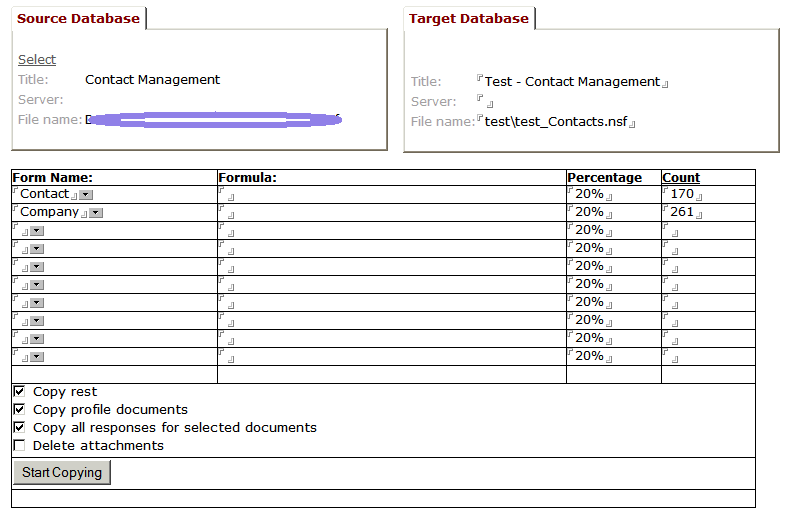

---
authors:
  - serdar

title: "Feedback needed for a new OpenNTF project..."

slug: feedback-needed-for-a-new-openntf-project...

categories:
  - Misc

date: 2012-01-27T17:06:28+02:00

tags:
  - domino-dev
  - open-source
  - openntf
  - wishlist
---

I have been trying to finish this for a couple of weeks in my free time (did I say free time?)... I have some code fragments for that and I need to combine them all.

Anyway, This is a very simple database, But it will be very useful for me and I hope for others... Before going forward, I need some feedback about it. The database is called **TestCopier** . The purpose of this application is to create test/development databases from production ones. The following screen shows a preview.
<!-- more -->

Some features in my mind:

- Percentage is important, but it's not the first X%. There is a randomizing algorithm to find different sets each run.
- The copied documents will have the exact same UNID with the source. However, the database will have different replica id.
- I'm planning to use Lotusscript, but it might be changed.
- User can save this profile for future uses.
- Delete attachments in copied docs would be possible (by David Leedy).

Now there are more complicated possibilities:

- Instead of forms, I can use only formulas. So it would be more flexible but we will lose "copy the rest" feature.
- Cross key lookups (by Nathan): Pickup some field values from, say, Customer docs and lookup them in some view (e.g. get selected customers' order documents).
- Run some kind of formula to profile documents to change profile document values in test databases. So you can preserve those changes each time you need it.
- Run some kind of formula to make changes every document, so you can alter some server/DB/Name references for copied documents.

These are all in my mind for now.

Any feedback will be appreciated.
