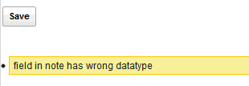
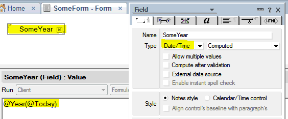

---
authors:
  - serdar

title: "More XPages error-fun..."

slug: more-xpages-error-fun...

categories:
  - Tips & Tricks

date: 2012-02-24T00:36:42+02:00

tags:
  - domino-dev
  - troubleshooting
  - xpages
---

I really enjoy debugging mysterious error messages from XPages...

Today, it's "field in note has wrong datatype":
<!-- more -->

I have experienced this problem upon a question from my client. Save button (which only submits the form) results in this error. After analyzing the page (analyze=delete all elements except the button) I decided that XPages elements have nothing to do with the problem. It was computing the document before saving, so that must be the problem. Indeed, I analyzed the form (analyze=delete fields part by part). Finally I found it. Here I will show you...

Let's create a simple form:

You will notice that: Field has a type for date/time but we are putting an integer... Simple mistake for a Notes developer, but it will work on client without any error...

Now add it to a data source and try to save it (put an error messages control to see the problem).

You have thousand fields on your form?

Have fun!!!
