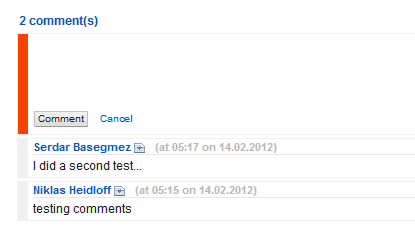

---
authors:
  - serdar

title: "XSnippets Upgrade: Commenting"

slug: xsnippets-upgrade-commenting

categories:
  - News

date: 2012-02-14T14:00:00+02:00

tags:
  - domino-dev
  - open-source
  - openntf
  - xpages
  - xsnippets
---

As [Niklas blogged](http://heidloff.net/home.nsf/dx/14.02.2012092405NHEBV6.htm), we added a new improvement on [XSnippets](http://openntf.org/xsnippets). At the recent version, registered users can add comments to snippets.
<!-- more -->
A couple of months ago, I [blogged](2011-11-latest-updates-deployed-on-xsnippets....md "latest-updates-deployed-on-xsnippets....htm") about rating update on XSnippets. In a similar way, I also developed commenting within [xInvolve Custom Control](http://www.openntf.org/internal/home.nsf/project.xsp?action=openDocument&name=xInvolve%20Custom%20Control). The recent version (released on OpenNTF) contains single control for commenting and rating. I have decided to seperate these two functions to improve usability.

Beta version of rating control has been deployed before. Now I have deployed the comment control. It supports server-side aggregation for comments and process RPC control for comment submission (Former version was using javascript tricks with hidden buttons). Currently we don't support anonymous commenting due to spam and security risks. We will adapt Captcha to support anonymous handling. In addition, I'm planning to implement ACF (Active Content Filtering), so we can support rich commenting with smileys, links and basic formatting in comments. I'd be glad if you comment about these plans or other nice-to-have features you may want.

The current comment control also allows seperating user names out of the custom control. For example, in XSnippets, we are using the profile control Niklas has designed. Another developer may want to use Connections Profiles control, etc. I designed a seperate custom control for user names, which takes the name parameter and render.

Next step is adding Designer plugin and Favorites function. Stay tuned and continue to add new snippets!
