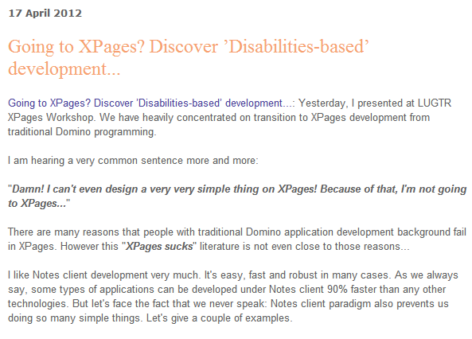
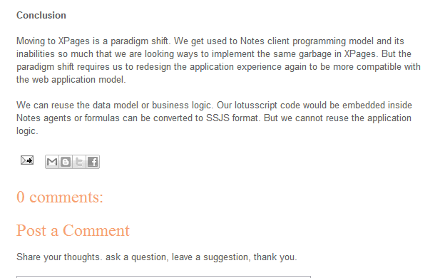

---
authors:
  - serdar

title: "Completely unacceptable 'Theft' by LotusLearns company..."

slug: completely-unacceptable-theft-by-lotuslearns-company...

categories:
  - Misc

date: 2012-04-21T10:29:07+02:00

tags:
  - blogging
  - community
---

I am blogging for more than two years. It's like a part-time job. I am doing this sacrificing my 'life' and 'time'. Many people attribute me and this is a great pleasure...

But sharing my ideas or knowledge on the WEB doesn't mean that people can **steal** them '**COMPLETELY** ' without my approval **even with an attribution** !
<!-- more -->
Yes, I have used the word "**stealing** " on purpose. Because this is what LotusLearns.com is doing! Kelley Smith, CEO of this company claims that she is doing this for Africans! Really!

For instance;

This has been **stolen** from my [article](2012-03-going-to-xpages-discover-disabilities-based-development....md "going-to-xpages-discover-disabilities-based-development....htm") and there is no attribution for that. Only a link above. Again no attribution on the bottom!

Even there was an attribution, RSS feeds don't provide a right to 'COPY' all contents. Many authors that have stolen articles in this site are not providing full articles on their RSS feeds. And Looking the structure of contents, we can easily see that these are not 'automatically' constructed. They have been edited one by one.

This is clear **theft** .

...and I am not alone;

Nathan T. Freeman: [LotusLearns that stealing web content is shameful](http://ntf.gbs.com/nathan/escape.nsf/d6plinks/NTFN-8TJS4G)
Kathy Brown: [How To Piss People Off -- LotusLearns](http://www.runningnotes.net/index.php/2012/04/20/how-to-piss-people-off-lotuslearns/)
Bill Malchisky: [LotusLearns -- The Good, The Bad, and Yes, It's Ugly (Underneath)](http://www.billmal.com/billmal/billmal.nsf/dx/04202012110012PMWMA5JQ.htm)
Chris Miller: [LotusLearns.com might be using your content without permission - beware](http://www.idonotes.com/IdoNotes/idonotes.nsf/dx/lotuslearns-might-be-using-your-content-without-permission-beware.htm)
Thomas Duff: [If your blog content appears on PlanetLotus, LotusLearns.com is likely infringing on your copyright...](http://www.duffbert.com/duffbert/blog.nsf/d6plinks/TADF-8TK2LH)
Jesse Gallagher: [LotusLearns did a poor job copying my post](http://frostillic.us/f.nsf/posts/26F88986C5D052CA852579E60078BFC8)
Tim Tripcony: [LotusLearns wants you to think my content is theirs](http://xmage.gbs.com/blog.nsf/d6plinks/TTRY-8TJSRD)
