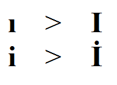

---
authors:
  - serdar

title: "\"Dotless i\", toLowerCase and toUpperCase functions: Use responsibly!"

slug: dotless-i-tolowercase-and-touppercase-functions-use-responsibly

categories:
  - Tips & Tricks

date: 2012-04-05T17:40:03+02:00

tags:
  - domino-dev
  - java
  - troubleshooting
  - xpages
  - bugs
---

"Dotless i" problem is the most profitable area in my revenue stream :)

Since the beginning of my career, I found and isolated dozens of bugs simply related to 'dotless-i'.
<!-- more -->
I have already blogged about it couple of times, but let me sum up the problem.

There are Turkish characters in our language, as in many others. But two exceptional cases are "ğ" (curved g) and "ı/İ" (dotless-i/dotted-I) characters. The first one is a whole different story that some linguistic experts discuss its necessity. The second one is a serious headache for us.

Dotless-i, is a lowercase 'i' without dot. The uppercase of this character is the usual "I". There is another character, "I with dot". The lowercase of this character is the usual lowercase "i".

Have you noticed the problem? This unsymetrical conversion causes a serious problem in programming. We face this problem mostly in Java applications because of (IMHO) poor implementation of toLowerCase and toUpperCase functions.

In Java, String.toLowerCase() method converts characters to lowercase **according to the default locale** . This causes problems if your application works in Turkish locale and especially if you are using this function for a file name or a url that must obey a certain character set.

I have blogged about two serious examples before: [The compile errors with Script libraries with "i" in their names](2011-11-mystery-solved-error-loading-use-or-uselsx-module.md "mystery-solved-error-loading-use-or-uselsx-module.htm") and [XSP Manager's fault if an XPage is in a database with "I" in its name](2011-06-its-classical-also-awful-xpages-is-running-java-huh.md "its-classical-also-awful-xpages-is-running-java-huh.htm").

There is a long history, as I said. For instance in some R7 version, router was unable to send a message to a recipient if his/her name starts with "I". Message reporting agents was not running in Turkish locale until R8. Anyone with Turkish locale could not install Lotus Notes 8.5.1 (it's real!). The list goes on...

There is almost no beta tester from Turkey and customers don't open PMR for these problems. So these problems are not going up to the first priority for development teams.

Even Java team has added a special warning to the latest documentation:

> **Note:** This method is locale sensitive, and may produce unexpected results if used for strings that are intended to be interpreted locale independently. Examples are programming language identifiers, protocol keys, and HTML tags. For instance, "TITLE".toLowerCase() in a Turkish locale returns "t?tle", where '?' is the LATIN SMALL LETTER DOTLESS I character. To obtain correct results for locale insensitive strings, use toLowerCase(Locale.ENGLISH).

 

My point is to give a simple suggestion for all Java programmers.

If you are using toLowerCase and toUpperCase function for non-textual context, use them as suggested above!

Use responsibly :)
