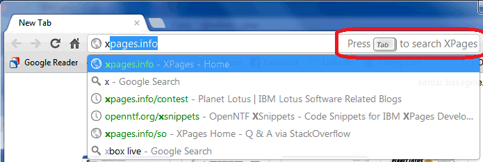
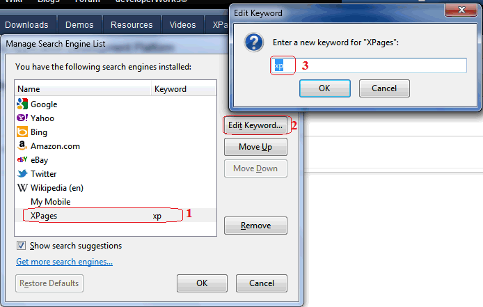

---
authors:
  - serdar

title: "OpenSearch functionality for XPages.info..."

slug: opensearch-functionality-for-xpages.info...

categories:
  - Portfolio

date: 2012-04-16T11:20:00+02:00

tags:
  - open-source
  - openntf
  - xpages
---

Today we have added a very simple feature to [XPages.info](http://xpages.info/) site. It provides an integrated search functionality to be used with browsers.

Here how to use it:
<!-- more -->
**For Chrome:**

1. Open [xpages.info](http://xpages.info/) site once.
2. Close your browser, reopen and at the address bar, start writing "xpages". Depending on how frequent you are using xpages.info, it will suggest the address in the bar. For me, "x" character is enough :)



3. Now you see a new instruction in the address bar: "Press Tab to search XPages". Do what it says :)


4. Press enter to see the search results related with your keyword:


**For Firefox:**

1. Open [xpages.info](http://xpages.info/) site.
2. Open Search Engine alternatives on the right and click "Add XPages.info" option.


3. Now XPages.info has been added to Firefox registered search engines. To use it more practically, Click "Manage Search Engines" here.



4. Select our search engine, click "Edit Keywords" and enter a new keyword like "xp" here. Click OK to close this dialog.

5. Now go to a new window and enter "***xp dynamic content*** " into the address bar... Voila!

I couldn't find a similar way to do this in Internet Explorer 9. If you know, please comment :)

**How we did it?**

It's pretty easy! You need to add two things to your database. First an XML file definition for opensearch:

```
<OpenSearchDescription xmlns="http://a9.com/-/spec/opensearch/1.1/" xmlns:moz="http://www.mozilla.org/2006/browser/search/">
<ShortName>XPages</ShortName>
<Description>XPages.info Search</Description>
<InputEncoding>UTF-8</InputEncoding>
<Url type="text/html" method="get" template="http://xpages.info/XPagesHome.nsf/SearchResults.xsp?search={searchTerms}"/>
</OpenSearchDescription>
```

<br />

<br />

You can also add some more properties here such as an icon to show in the search engine listing.

We put this xml files into File Resources section of our database. Then we added a resource definition into the HEAD section of our home page:


That's all!

Now I have two To-Do's for myself. I'll try to extend search functionality of XPages.info to provide single point of search for XPages-specific information.

The second To-Do is adding this to [XSnippets](http://openntf.org/xsnippets). I noticed that searching snippets is not practical in the current situation.

OpenSearch provides much more possibilities than this. You can visit [OpenSearch.org](http://www.opensearch.org/Home) for more information...
