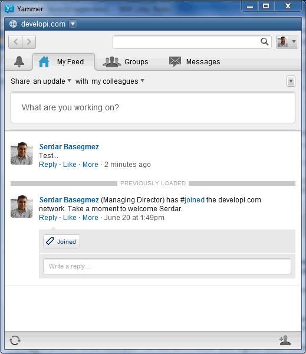
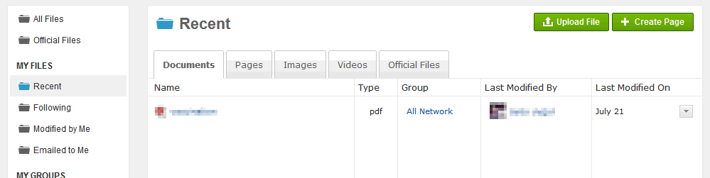

---
authors:
  - serdar

title: "Five weeks of Yammer experience..."

slug: five-weeks-of-yammer-experience...

categories:
  - Articles

date: 2012-07-27T21:30:00+02:00

tags:
  - cloud
  - lotus-connections
  - out-of-bubble
  - social-software
---

I'm an author in an additional blog for more than a year. As a scientific skeptic blog, we are posting articles or short entries about hoaxes, legends, pseudo-science, alternative medicine, bad science news and similar stuff.

At the begining of this year, we have invited more authors to the group and we have become a micro-community. While we were using Google Groups, after a couple of weeks, it became a serious problem for group members to engage the discussion due to the e-mail over-loading.
<!-- more -->
Sometimes someone post an idea, news article or a research into a group to start the discussion. After replies and replies to replies (!), my friends (especially those are not monitoring messages every minutes like me!) are getting crazy about massive number of messages every day without any clue about which has been answered or not...

Two months ago we have decided to look for something else. We might create a private page on Facebook but we are all using FB in our private lives. While preventing e-mail over-loading, Facebook would cause an 'notification-overloading' for us. I have tested some other alternatives like [Asana](http://asana.com/), [Hall](http://hall.com/)and [Podio](http://podio.com/). Asana and Podio are too GTD-centric (getting things done) and Hall is just an alternative for Skype persistent chats (BTW, it's great, you should test it!).

I came up with the **Yammer** idea. While speculations about a possible Microsoft acquisition were everywhere around the web, I was really curious about what it is like. After a short testing period, we have decided to go with it. I have registered a network for my own company and created an external network (this is the only way if you want to invite people with different e-mail domains).

**So what is it?**
Many people are describing IBM Connections as a *corporate Facebook* . After seeing Yammer, this definition seems to be ridiculous to me. Because Yammer is a *copy-cat* of the Facebook. The visual and functional experience is almost the same as Facebook (But you can change its color!). I think a set of useful tools are coming with the paid version but I'd never pay for a private facebook :)

It really helped us. Especially desktop and mobile clients are more used than the web site. We can engage our discussion easily, share articles or files and work on new blog entries (even in real time).

**About its shortcomings...**
At the beginning, we have experienced a serious problem on connection speed. It was really slow (especially from Turkey). However, for a week or so, it seems that the speed problem has been resolved. Web site and mobile application work faster. Since the desktop application has been developed using Adobe Air; it is still slow...

The biggest problem is the notification. Sometimes it creates false signals about notifications and sometimes it skips. Desktop application notification is a silent small window appearing a couple of seconds on the screen and it cannot be customized, mobile notifications are not stable, etc.

It might not be preferred for big companies but in our case, we want to be notified about every conversation in the network which is not the case (or I couldn't find a related configuration). You can select people to be notified in conversations but there is no option to notify all users in the network. There is an announcement option but it's not a part of standard conversation stream, instead more useful for meeting alerts and so forth. I found interesting issues like when I create a page, it doesn't notify people unless I create a conversation. Clearly, Yammer tries to reduce information over-loading but it should be more customizable.

Another problem is that Yammer has no any task/todo mechanism. I cannot think of any social platform without some level of '*get things done* ' stuff. So we are currently unable to drop Asana.

**Comparing to IBM Connections or SmartCloud solutions...**
Yammer is definitely more smooth from an end-user perspective. Comparing to the current versions of social platforms in SmartCloud or Connections, the usability is better. Of course, the most important reasons are its simplicity and similarity to Facebook.

On the other hand, IBM solutions are far more capable than Yammer. Activities, Files and Blogs provide an important difference in functionality. I don't have paid version so I can't decide how much customization it allows for profiles, authentication, user directory, e-mail notifications and UI customization, but since it's a cloud-only solution, it would be similar to SmartCloud services.

Absense of desktop application in Connections portfolio is a problem. In addition, Connections mobile application is not conversation-centric, so it would be unfair to compare with Yammer's mobile app.

I should also underline that Yammer differs in style. It is a conversation-centric application. Information (files and contents) and categorization are not selected as a top priority.

At the bottom point, Yammer is still an ideal solution for smaller companies that need lots of **micro-community interaction** . We are using Yammer as a huge chat room, nothing more. Those who need more functionality like e-mail, files, forms etc; they will have to skip Yammer for now.

I am curious about what Microsoft will change in Yammer in the future to adapt it to big companies. The current version will probably be integrated into Office365 and Skype but I can't imagine how it will affect Microsoft's directions in the Sharepoint product.
