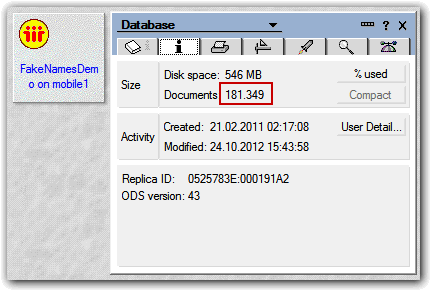

---
authors:
  - serdar

title: "Experimenting DOTS task vs. Java Agent"

slug: experimenting-dots-task-vs.-java-agent

categories:
  - Tips & Tricks

date: 2012-11-09T19:45:00+02:00

tags:
  - domino-dev
  - dots
  - performance
  - plugins
  - xpages
---

DOTS (Domino OSGi Tasklet Service) [project](http://www.openntf.org/internal/home.nsf/project.xsp?action=openDocument&name=OSGI%20Tasklet%20Service%20for%20IBM%20Lotus%20Domino) has been contributed into OpenNTF last year. Basically, it provides a way to create server tasks for Java developers.

This is huge. Basically we could run our Java code in a similar way with a couple of other techniques, but DOTS provide many advantages. I'll dive deep on this in a seperate blog post. For now, take it as a teaser :)
<!-- more -->
You can refer to [Niklas's blog entry](http://www.openntf.org/blogs/openntf.nsf/d6plinks/NHEF-8RXCN2) to setup DOTS in your environment.

For this experiment, I'm using an exploded version of [FakeNames database](http://xpagescheatsheet.com/) by David Leedy. In the past, I have duplicated all contents for several times and I'm still using it to crash my server :)



First, I have created a '*terrible* ' Java agent which does nothing.

```
import java.util.Date;

import lotus.domino.AgentBase;
import lotus.domino.AgentContext;
import lotus.domino.Database;
import lotus.domino.Document;
import lotus.domino.NotesException;
import lotus.domino.Session;
import lotus.domino.View;

public class JavaAgent extends AgentBase {

       public void NotesMain() {

               try {
                       Session session = getSession();
                       AgentContext agentContext = session.getAgentContext();

                       Date startTime=new Date();

                       Database db=getSession().getDatabase("", "test/fakenames.nsf", false);

                       longJob(db);

                       long duration=((new Date().getTime()) - startTime.getTime())/1000;                
                       System.out.println("Finished in " + String.valueOf(duration) + " secs... - ");

               } catch(Exception e) {
                       e.printStackTrace();
               }
       }

       public void longJob(Database db) throws NotesException {

               int count=0;

               View view=db.getView("byName");

               System.out.println(view.getTopLevelEntryCount());

               for(int i=0; i < view.getTopLevelEntryCount(); i++) {
                       Document doc=view.getNthDocument(i);

                       if(doc!=null) {
                               if(doc.getItemValueString("FirstName").startsWith("Sa")) {
                                       count++;
                               }

                               doc.recycle();
                       }
               }

               view.recycle();

               System.out.println(count);
       }

}
```

<br />

<br />

As I said before, it does nothing but counting people that has a first name starts with "Sa". So it does something, consume memory and CPU. Who cares :)

Then I implemented the same code as a DOTS task:

```
import java.util.Date;

import lotus.domino.Database;
import lotus.domino.Document;
import lotus.domino.NotesException;
import lotus.domino.View;

import org.eclipse.core.runtime.IProgressMonitor;

import com.ibm.dots.annotation.RunOnStart;
import com.ibm.dots.task.AbstractServerTaskExt;
import com.ibm.dots.task.RunWhen;

public class AnnotatedTasklet extends AbstractServerTaskExt {

       public AnnotatedTasklet() {
       }

       public void dispose() throws NotesException {
       }

       @Override
       protected void doRun(RunWhen runWhen, IProgressMonitor monitor)        throws NotesException {
       }
       
       @RunOnStart
       public void runOnStart( IProgressMonitor monitor ) throws NotesException {
               Date startTime=new Date();

               Database db=getSession().getDatabase("", "test/fakenames.nsf", false);
               
               longJob(db);
               
               long duration=((new Date().getTime()) - startTime.getTime())/1000;                
               logMessage("Finished in " + String.valueOf(duration) + " secs...");
       }
       
       public void longJob(Database db) throws NotesException {
               
               int count=0;
               
               View view=db.getView("byName");

               System.out.println(view.getTopLevelEntryCount());
               
               for(int i=0; i < view.getTopLevelEntryCount(); i++) {
                       Document doc=view.getNthDocument(i);
               
                       if(doc!=null) {
                               if(doc.getItemValueString("FirstName").startsWith("Sa")) {
                                       count++;
                               }
                               
                               doc.recycle();
                       }
               }
               
               view.recycle();
               
               System.out.println(count);
       }
}
```

<br />

<br />

Now, results:

```
> tell amgr run "test\XPagescrash.nsf" 'LongJobAgent'
09.11.2012 19:38:39   JVM: Java Virtual Machine initialized.
09.11.2012 19:38:39   AMgr: Start executing agent 'LongJobAgent' in 'test\XPagescrash.nsf'
09.11.2012 19:38:39   Agent Manager: Agent printing: 181349
09.11.2012 19:41:02   Agent Manager: Agent printing: 2227
09.11.2012 19:41:02   Agent Manager: Agent printing: Finished in 143 secs... -
09.11.2012 19:41:02   AMgr: Agent 'LongJobAgent' in 'test\XPagescrash.nsf' completed execution
```

<br />

<br />

```
> load dots
> Listening for transport dt_socket at address: 8001
> WARNING: Using pde configuration New_configuration located in C:\Lotus\Domino\Data\domino\workspace-dots\pde.launch.ini
09.11.2012 19:42:40   Domino OSGi Tasklet Container started ( profile DOTS )
> 181349
> 2227
09.11.2012 19:43:22   [DOTS] (annotated) Finished in 41 secs...
```

<br />

<br />

You got the idea. The same Java routine runs in **143 seconds** as a **Java agent** and **41 seconds** as a **DOTS task** \*.

###### (\*) Clinical trials from Developi labs :)
