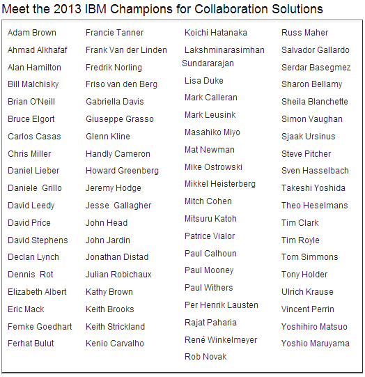

---
authors:
  - serdar

title: "Still part of IBM Champions Program!"

slug: still-part-of-ibm-champions-program

categories:
  - News

date: 2012-12-12T10:43:09+02:00

tags:
  - community
  - ibm
  - ibm-champions
  - personal-news
---

In 2011, I have been honored to be recognized as IBM Champion for IBM Collaboration Solutions (formerly, Lotus Software). Yesterday, 2013 class has been[announced](https://www-304.ibm.com/connections/blogs/socialbusiness/entry/december_10_2012_10_05_pm3?lang=en_us) by our precious community manager Joyce Davis and my title has been renewed for 2013.
<!-- more -->

There are new champions on the list as well. But I am most delighted to see my dear friend, fellow founder of [Turkish Lotus User Group](http://www.lotusturkiye.org "Turkish Lotus User Group") and neighbour Ferhat Bulut (with the well-deserved nick name: [bestcoder](http://www.bestcoder.net/)!).

Ferhat is working for Akbank, one of the largest banks in Turkey and he is an expert on XPages. We know him from last year, as the developer of silver prize contribution at the [OpenNTF Contest](http://xpages.info/contest). I'm frequently sending people to him suffering from XPages, web services or blackberry integration issues and he kindly helps many people in our local community in his free time.

Here is the list of people selected as IBM Champions.

