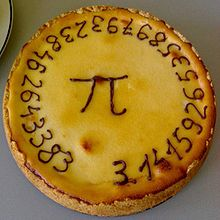

---
authors:
  - serdar

title: "Happy Pi Day present: Pi Calculator for XPages..."

slug: happy-pi-day-present-pi-calculator-for-xpages...

categories:
  - Portfolio

date: 2013-03-14T09:45:00Z

tags:
  - domino-dev
  - fun
  - java
  - open-source
  - xpages
---

Today is the "[Pi Day](http://en.wikipedia.org/wiki/Pi_Day)"...

Last week I was playing with [Threads and Jobs](http://www.openntf.org/internal/home.nsf/project.xsp?action=openDocument&name=Threads%20and%20Jobs) project from OpenNTF. I needed a very long job to be run n the server-side. I have thought calculating pi digits would be a cool selection :)
<!-- more -->
I found a [Javascript-based Spigot](http://mysite.verizon.net/res148h4j/javascript/script_pi_spigot.html) algorithm by Stephen R. Schmitt and easily converted to Java (sorry about the code!).

Notice that, on an average machine it calculates 10,000 digits in less than a minute. Now consider, ENIAC has calculated 2037 digits in 70 hours in 1949!

However, to calculate trillion digits would be tough with this algorithm. Because we need a large String buffer and a large integer array for calculation. Integer array is around 3.5 times the digit count and string buffer has one chars per digit. So we are limited with the heap size. In a non-XPages environment, if you don't keep string buffer, you would be able to calculate 2.5 million digits with standard memory :)

Anyway, it was fun and I wanted to share it. Here is the screencast:

<iframe width="640" height="360" src="https://www.youtube.com/embed/lCOFpQ6pi_U?rel=0&amp;vq=large" frameborder="0" allowfullscreen></iframe>

The database is on my Github Repo: <https://github.com/sbasegmez/Blogged/tree/master/PiMadness>
