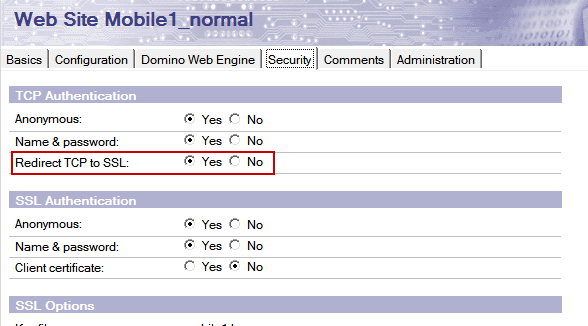
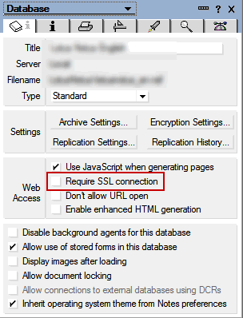

---
authors:
  - serdar

title: "Two critical HTTP problems in Domino 9..."

slug: two-critical-http-problems-in-domino-9...

categories:
  - Tips & Tricks

date: 2013-03-29T14:19:23+02:00

tags:
  - bugs
  - domino-admin
  - troubleshooting
---

After I upgraded my servers to Domino 9, I have found two problems affecting HTTP task.

**1. Redirect TCP to SSL problem...**

My HTTP task stopped responding just after the upgrade. When I look into thread logs I saw that it was redirecting every requests to the same URL! After a couple of tests, I found that if you have "Redirect TCP to SSL" checked in your Internet Site document, it fails with infinite redirection problem.
<!-- more -->

I posted the issue into the N/D 9.0 Social Edition forum and saw that I'm not alone. It seems like the same issue happens when you check "Require SSL Connection" in specific databases.

IBMers couldn't repeat the problem. After dozens of tests I found out a specific setting in my configuration was the root cause.

Since one of my servers was behind WAS plugin before, I had a notes.ini setting in my configuration document. After deleting this, it got back to normal. So,

**If you are forcing SSL redirection either by "Redirect TCP to SSL" or "Require SSL Connection", delete "HTTPEnableConnectorHeaders=1" setting from notes.ini file.**

Forum entry: [http://www-10.lotus.com/ldd/ndseforum.nsf/xpTopicThread.xsp?documentId"692BEB1A4244C685257B39003F4264](http://www-10.lotus.com/ldd/ndseforum.nsf/xpTopicThread.xsp?documentId”692BEB1A4244C685257B39003F4264)

**2. Traveler behind IHS (IBM HTTP Server)**

The second problem is with Traveler Server and a new feature of Domino 9: IHS. By this new version, you have the chance to position IHS in front of your Domino servers running in Windows platform. It has a couple of advantages but the most obvious one for me is to be able to use 'modern' SSL certificates :)

However, if you are running Traveler server at the same time, you experience a strange problem. It works for a while and then stops working for iOS (I didn't test Android).

The problem is, when you make a profile change, Traveler asks the client to send a 'PROVISION' command with a non-standard HTTP response code (449). But the IHS module for Domino does not transfer this code between the server and mobile client. So iOS device stops working and you cannot register any more devices.

What you should do is to open a PMR and receive updated "*mod_domino.so* " file.

Forum entry: <http://www-10.lotus.com/ldd/ndseforum.nsf/xpTopicThread.xsp?documentId=4F341BE6082FF4A985257B3600374B38>
