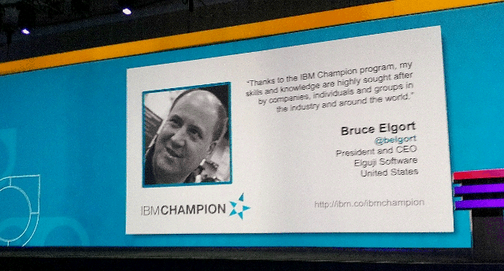
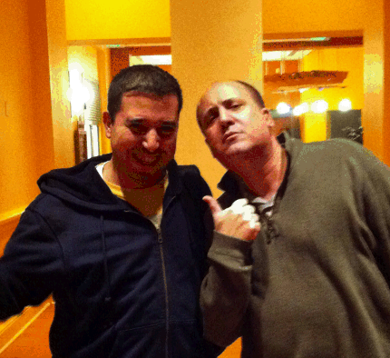

---
authors:
  - serdar

title: "Thank you Mr. Bruce Elgort..."

slug: thank-you-mr.-bruce-elgort...

categories:
  - Misc

date: 2013-10-02T18:00:00+02:00

tags:
  - community
  - openntf
---

Before writing this post I tried to remember when I have met Bruce for the first time. It was just 2.5 years ago when I received a twitter DM from him. I was at an airport in Germany waiting the boarding time. I remember had a short discussion over Skype.

2.5 years? Really? I feel like I know Bruce for decades.
<!-- more -->

Bruce Elgort is one of the founders of OpenNTF, which is a very important initiative which bands **passionate developers** together, improves **communication and collaboration** within a global community and **decreases knowledge barriers** around the technology. And if you have ever been a part of a non-profit initiative, you would know that it's not easy. Many people behind OpenNTF have done a great job here. Especially Bruce, by managing a smooth transition from a community organization to a legal non-profit corporation in the last couple of years.

Tomorrow, Bruce will be at OpenNTF Board meeting for the last time. As you may already know, he is [stepping down](http://bruceelgort.com/2013/07/16/more-changes-on-the-horizon/) as Chairman of OpenNTF after his involvement for 12 years.

Bruce is also the producer and co-host of [Taking Notes Podcast](http://www.takingnotespodcast.com/)for 8 years and 177 episodes and a blogger since 2003. I'm not mentioning many other private activities inside or outside yellow bubble. He is one of the leading figures in the Lotus Community.

This is not the day Bruce is leaving us all. But I think it's symbolically a proper day to thank Bruce for all he has done for the community.

Apart from yellow-stuff, he is a great guy and a good friend for me.

It doesn't matter if you met him or not. If Bruce knows you and your photo, you will get a warm hug and loudy welcome from Bruce at the moment he saw you. And regarding his eyes, I still couldn't figure out how he recognize you from a distance :)

He is on the other end of Skype and helpful all the time. His inspiring personality just cheers you up and makes you more motivated for living. Bruce has a gift on speaking, presenting and making fun. You'll never get bored or stay sad after you talked to Bruce!

I have met Bruce in person at Lotusphere 2012. I have arrived to Kimonos, found Bruce and he has introduced me around 200 people from the yellowsphere. There is more... At IBM Connect 2013, I had the first Lotusphere session with Bruce. He has helped my preperation, managed the session and calmed me down before and during the session. If he wasn't there, our audience would have been looking into a shaking man stood silent for 10 minutes and that would be the lowest-scored session in the history :)

Looking back, in the last 2 years, Bruce and Gayle Elgort became a part of my family.

**Thank you Bruce Elgort, for OpenNTF, for Taking Notes, for your inspiration, friendship and mentoring!**
