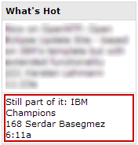
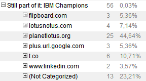

---
authors:
  - serdar

title: "My previous blog post was 'Hot'!"

slug: my-previous-blog-post-was-hot

categories:
  - Misc

date: 2013-12-07T11:19:43+02:00

tags:
  - blogging
  - community
  - opinion
---

Yesterday, I have blogged about the [renewal of my IBM Champion title](2013-12-still-part-of-it-ibm-champions.md "still-part-of-it-ibm-champions.htm").

This morning I woke up with lots of notifications on my mobile. Apparently, my dear friend [Bruce](http://bruceelgort.com/) liked my blog post very much and he has posted it everywhere (Twitter, Facebook, Linkedin Google Plus). The real surprise was on PlanetLotus waiting for me :)
<!-- more -->

Wow! I must be really famous and people want to know about my happiness. Thank you all! :)

OK I'm joking. Many of you know it but for those who are not aware of this, the following is the **real** statistics from my BlogStats database.

Do the math! Removing internal links and not categorized ones (these are mostly coming from feed readers and E-mail subscriptions), I have only 38 readers for this specific post.

P.S. That's why we don't want to publish hit counts on [CollaborationToday](http://collaborationtoday.info/).
