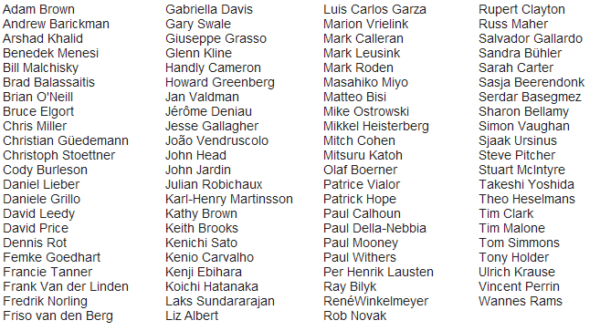

---
authors:
  - serdar

title: "Still part of it: IBM Champions"

slug: still-part-of-it-ibm-champions

categories:
  - News

date: 2013-12-06T14:08:32+02:00

tags:
  - ibm
  - ibm-champions
  - personal-news
  - community
---

Yesterday, Oliver Heinz and Joyce Davis [announced](http://www-304.ibm.com/connections/blogs/socialbusiness/entry/announcing_the_2014_ibm_champions_for_ics1?lang=en_us) IBM Champions of 2014.

I have been recognized as IBM Champion for the third time but it's still exciting like the first time :)
<!-- more -->
Congratulations to everyone, especially new champions.

***2014 IBM Champions***

So proud to be listed here, with these fantastic people... But remember, there are many great people outside of this list. They might not have the title for this time but they are helping others and improving the value of the technology.

A very big thank you, to all people who built the foundations of a unique community around this great technology...
