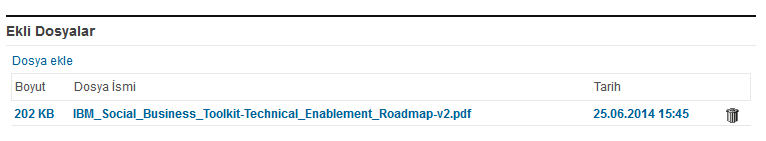

---
authors:
  - serdar

title: "Changing URL in File Download Control..."

slug: changing-url-in-file-download-control...

categories:
  - Tips & Tricks

date: 2014-06-25T14:15:58+02:00

tags:
  - domino-dev
  - xpages
---

After a very long period of silence, here I am with a tiny little trick about File Download Control in XPages.

I saw that there are lots of questions about this component, related to showing attachments instead of downloading them. Instead of using Repeat controls to iterate within @AttachmentNames, I'm using the native download control with a little SSJS function to solve this problem.
<!-- more -->
Stephen Wissel [explained](http://www.wissel.net/blog/d6plinks/SHWL-86QKNM)how to build a download url with the XPages syntax.

The old style notation (which DOES NOT work in XPiNC):

```
http(s)://[yourserver]/[application.nsf]/[viewname|0]/[UNID| ViewKey]/$File/[AttachmentName]?Open
```


The XPages syntax:

```
http(s)://[yourserver]/[application.nsf] /xsp/.ibmmodres/domino/OpenAttachment/ [application.nsf]/[UNID|/$File/[AttachmentName]?Open
```


File Download control builds the second url for attachments. However, Domino server adds "content-disposition" header for download so it forces browser to download the file.

This trick shows how easy to change the download link. Here is our File download control:


```xml
<xp:fileDownload
     rows="30"
     id="fileDownload1"
     displayLastModified="false"
     hideWhen="true"
     allowDelete="true"
     value="#{sessionDoc.Files}"
     createdTitle="Tarih"
     displayType="false"
     fileNameTitle="Dosya İsmi"
     fileNameHrefValue="#{javascript:getAttachmentUrl(sessionDoc, fileItem)}"
     sizeTitle="Boyut"
     deleteImageTitle="Sil"
     width="100%"
     var="fileItem">
</xp:fileDownload>
```


The first trick, I'm passing the Document object and the fileItem variable to my SSJS function. Nerd detail: fileItem is an "[*DominoDocument.AttachmentValueHolder*](http://public.dhe.ibm.com/software/dw/lotus/Domino-Designer/JavaDocs/DesignerAPIs/com/ibm/xsp/model/domino/wrapped/DominoDocument.AttachmentValueHolder.html)" object. In the SSJS function, I will calculate the new URL, but there are things to be considered:

```js
function getAttachmentUrl(doc, fileItem) {
     if(fileItem==null || doc==null) {
             return "#";
     }
     
     var fileName=fileItem.getName();
     
     if(fileName==null || fileName=="") {
             // This document is persistent. Not saved, so we will open normally
             return fileItem.getHref();
     } else {
             if(@ClientType()=="Notes") {
                     // XPiNC does not support old school.
                     // TODO XPiNC solution?...
                     return fileItem.getHref();
             }

             // We will construct classical path.
             
             var dbWebPath=getWebPath(doc.getParentDatabase());
             var docId=doc.getDocument().getUniversalID();
             
             return dbWebPath+"/0/"+docId+"/$File/"+fileName+"?Open";

     }
}

// @author: Tommy Valand
function getWebPath( db:NotesDatabase ){
     try {
             db = db || database;
             return '/' + db.getFilePath().replace( /\\/g, '/' );
     } catch( e ){
               
     }
}
```


Two special cases we should consider. If document has been uploaded but not saved yet, Domino keeps the document in a folder on the server. At this point, fileItem returns an empty "name" field (the file name is stored in "persistentName" field at this stage). Nothing to do about it. We should use the generated HREF. The same for XPiNC. Old style URL does not work there. I don't need XPiNC for now, so I didn't look around if there is a valid solution.

I hope this helps.

BTW, one more trick: This file will be opened on the same window and File Download control does not provide an option for that. But thanks to [Ulrich 'eknori' Krause](http://www.eknori.de/), there is a [nice solution](http://www-10.lotus.com/ldd/xpagesforum.nsf/xpTopicThread.xsp?documentId=765C8DB0E2884CCC8525799E006DAC28) for this problem. You just add these lines to your theme...

```xml
<!-- File Download Link -->
<control>
     <name>Link.FileDownload</name>
     <property mode="override">
             <name>target</name>
             <value>_blank</value>
     </property>
</control>
```
