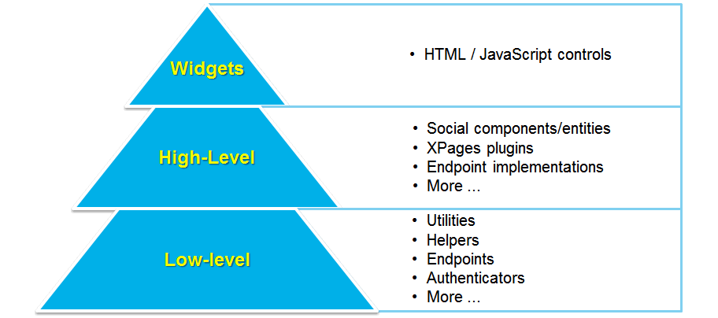
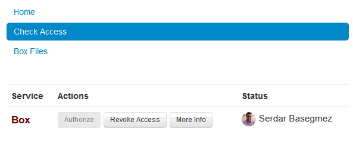
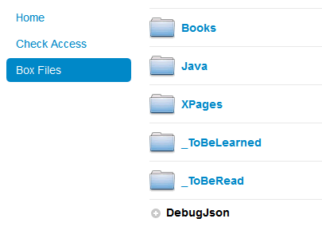

---
authors:
  - serdar

title: "Deep Dive into Social Business Toolkit with XPages: The Box Integration (1)"

slug: deep-dive-into-social-business-toolkit-with-xpages-the-box-integration-1

categories:
  - Articles

date: 2014-09-15T15:00:00+02:00

tags:
  - domino-dev
  - java
  - open-source
  - xpages
  - security
---

I have been working on IBM Social Business Toolkit SDK for a long time. Last year we have introduced [a couple of cool demos](2014-02-ibm-connect-2014-slidedeck-on-the-ibm-social-business-toolkit-sdk.md "ibm-connect-2014-slidedeck-on-the-ibm-social-business-toolkit-sdk.htm") on IBM Connect with my friend [Graham Acres](https://twitter.com/gacres99).

One example was the XPages integration with Basecamp. It has been on my to-do list for months to blog more details on this topic. Finally, here I am...

This is going to be a series of blog post. What I'm planning is to blog about a basic example that integrates XPages applications with one or more cloud-based services for specific scenarios. I have selected [The Box](http://box.com/) as the first example. The most important reason would probably be that I'm using Box extensively for myself :)
<!-- more -->
First of all, let's talk about the Social Business Toolkit briefly.

All products within IBM Social Business platform has some kind of APIs to provide gates for external integration. The primary problem working with these APIs, they are not consistent and they might change a little bit on each versions. For instance, the profiles module in IBM Connections and IBM SmartCloud are almost the same. "The almost" means that there are minor/major differences between the usage of APIs. Another problem is implementing different levels of mechanisms (e.g. authentication, consuming, utilities, etc.).

Here, SDKs (Software Development Kit) make our lives easy. The Social Business Toolkit is the SDK for IBM Social Business platforms. It makes it extremely fluid to integrate into IBM Social applications in a consistent way from different languages.



SBT can be divided into three main parts. On the top level, HTML and JavaScript-based widgets provide easy integration into web applications without any back-end code. For example, you can use a file-list widget to display files of any user from an IBM Connections implementation.

High-Level API of SBT provides special implementations targeting IBM products. For instance, you can take a file object from IBM Connections, natively get its properties, add comments, etc. You don't need to deal with any specifications around Connections or SmartCloud APIs. Those are all hidden under the cover of SBT, handled for you.

The base level, Low-Level API contains generic libraries that can be used for any purpose. There are different sets of utility artifacts (e.g. Json parsers/generators, XML processing, String utilities, etc.), authentication-helpers, endpoints, etc. These are general-purpose libraries for use with any REST-based or XML-based autheticated service out there. During this blog series, we will be using the low-level API to extend capabilities of SBT to consume other APIs on the cloud.

A more clear example to understand these layers, let's take the authentication issue. Every request to a service should be wrapped with authentication. In SBT, this is handled by **Endpoint** s which store all the information we need to connect the remote service. If you are using an anonymous endpoint, it does nothing. For basic authentication, it adds the authentication header for every single request. For OAuth, it gets the necessary token for the first time and keep adding this token for every single request. Sometimes, it's more complicated. Twitter, for instance, makes it required to encrypt request headers using the OAuth tokens. So, there are lots of Endpoint implementations (and handlers) for different types of authentications in the Low-Level API.

Even though there are standards on the digital world, every developer knows that standards are bended :) This is also valid for OAuth. If you are using OAuth to connect IBM SmartCloud, there are minor changes over the implementation. So there are "SmartCloudOAuthEndpoint" and "SmartCloudOAuth2Endpoint" implementations specifically designed for SmartCloud API. This is the High-Level API. Using these implementations, you don't need to cover any differences in the OAuth for SmartCloud.

Now, to show a file information from the JavaScript is a bit complicated. SBT does not provide a JavaScript implementation for these endpoints. All implementations stand in the back-end server platform (e.g. J2EE). We have a proxy services to make it possible to consume all those implementations through JavaScript-based request and also, widgets to build quick user interface elements on the client-side. This is the third level of SBT.

To get more information about IBM SBT, you can start with [Social Business Toolkit homepage](https://developer.ibm.com/social/)... Also, before you go, I recommend learning more about OAuth from [Julian Robichaux's great session](http://www.slideshare.net/dominopoint/dd12-oauth-for-domino-developers).

Our series is all about using IBM SBT to connect any third party services using low-level api. But first, developers need to do some fact-checking. Is SBT the best solution for what we need? **Just Because You Can, Doesn't Mean You Should!**

If you are going to integrate with IBM Social environments, clearly, SBT is the way to go. But in case of applications like Box, things get complicated. Box introduces a set of ready-to-use [SDKs](https://developers.box.com/sdks/) for different options. What is the motivation for using SBT and develop an implementation layer for a Box integration, instead of using Box Java SDK alone? The answer is hidden in your application. The level of integration might not be very deep, you might not trust 3rd party libraries or you want to develop more than one integrations for different applications at the same time!

Let's consider a scenario, where you are developing a document approval application to be used by suppliers or similar stakeholders. Your users has many documents in different services such as DropBox, Box, SmartCloud, Basecamp, etc. You want them to enable importing and exporting files between those services and your application. In such a scenario, the level of integration is not very deep (you are just listing, importing and uploading files). You want to support many services at the same time. You should use SBT for SmartCloud or other integrations anyway. Therefore SBT adds value around simplicity here. Design one implementation over one library and this approach will provide single point control of configuration, logging and profiling.

Now, let's get into technical stuff about how we can do such integration. In this very first post we will introduce the OAuth2 EndPoint implementation for the Box.

As we said before, an endpoint provides an abstraction to seperate levels of "how we interact" and "how we authenticate". It stores connectivity methods for HTTP (e.g. GET, POST, etc.) and bind authentication method to the connection implicitly. This is pretty easy when you need a basic (username/password) or SSO (LtpaToken) authentication. It gets the credentials (a cookie or an authorization-header) and adds it on every single request.

In case of OAuth, it's more complicated. In such a connection, there are always additional steps to be considered. In the first connection, user should be redirected to the remote service, get the authorization and the token returning back should be intercepted and saved for the future requests. This additional steps will be completed by "OAuth Handlers".

OAuth is a standard protocol except the fact that different companies interpret some aspects of the protocol in their own taste (Welcome to the chaos of internet standards!). That causes a great problem for such development efforts.

As an example, Box authorization needs a "redirect_uri" parameter to determine where to redirect back after authentication. However, the standard OAuth2 implementation of SBT uses "callback_uri" in the usual form (redirect_uri is optional and this should be preconfigured according to the specification). So the right strategy is to modify the original endpoint by inheritence. We should assure that our changes are minimal to keep maintainability in next versions. Since the authorization URL is constructed in the handler, we are using an anonymous inner class for simplicity. Here is the new [Endpoint implementation](https://github.com/sbasegmez/Blogged/blob/master/CloudFile/odp.cloudfile/Code/Java/com/developi/sbt/extensions/BoxEndpoint.java) for Box:

```java
package com.developi.sbt.extensions;

import java.io.UnsupportedEncodingException;
import java.net.URLEncoder;

import com.ibm.sbt.core.configuration.Configuration;
import com.ibm.sbt.security.authentication.oauth.consumer.OAuth2Handler;
import com.ibm.sbt.services.endpoints.OAuth2Endpoint;

public class BoxEndpoint extends OAuth2Endpoint {

  public BoxEndpoint() {
     super(new OAuth2Handler() {
        @Override
        public String getAuthorizationNetworkUrl() {
           String originalUrl=super.getAuthorizationNetworkUrl();
           
           StringBuilder url = new StringBuilder();
           try {
              url.append(originalUrl);
              url.append('&');
              url.append(Configuration.OAUTH2_REDIRECT_URI);
              url.append('=');
              url.append(URLEncoder.encode(getClient_uri(), "UTF-8"));
           } catch (UnsupportedEncodingException e) {
           }
           return url.toString();  
        }
     });
  }

}
```


In the demo application, I have used two additional Java classes to cover some problems of SBT for XPages. The first is the "[NSF-Cached Credential Store for IBM Social Business Toolkit](http://openntf.org/XSnippets.nsf/snippet.xsp?id=nsf-cached-credential-store-for-ibm-social-business-toolkit)" snippet I have created a while ago. When you use SBT for XPages, the OAuth tokens for users are stored in memory. That's a bit annoying during development, because it gets cleared every time you make a change in your application. This snippet is caching tokens within the database using MIMEBean.

The second thing missing in XPages is the service parameters for endpoints. To get connected to the remote service, you need to register your application and get "consumer-key" and "consumer-secret". Normally, you have to put these values into faces-config.xml. That creates a problem if you have different test and production applications. Because faces-config is a part of your design, not configuration. In addition, if you publish your application to a source repository (like I do), you disclose these secret values. Therefore I have used an appstore definition and caching bean for these configuration values.

Far back, before SBT, we had Social Enabler project for XPages. We were using an NSF-based tokenstore. This tokenstore still exists for OSGi artifacts, but we have no implementation came with the SBT. Still waiting ;)

I have also used some [utlity functions](https://github.com/sbasegmez/Blogged/blob/master/CloudFile/odp.cloudfile/Code/Java/com/developi/toolbox/RestUtils.java) from our demo in [IBM Connect 2014 session](2014-02-ibm-connect-2014-slidedeck-on-the-ibm-social-business-toolkit-sdk.md "ibm-connect-2014-slidedeck-on-the-ibm-social-business-toolkit-sdk.htm"). These are providing easy-to-use access for REST services to get JSon response back.

Once you have the endpoint, you can use all services in the remote applications, using SSJS or Java. But I must say I found it very useful to have a [service bean](https://github.com/sbasegmez/Blogged/blob/master/CloudFile/odp.cloudfile/Code/Java/com/developi/cf/xsp/BoxService.java) to implement all services natively in Java. That way, we can add caching, more precise error-checking, etc.

The demo is on the Github: <https://github.com/sbasegmez/Blogged/tree/master/CloudFile>



The initial demo does nothing now. It authorizes you into your Box account, allows you to get a list of files and look into folders (I didn't implement an Up button, that's just demo).



Have fun!!!. I will continue with some different applications around this concept.
