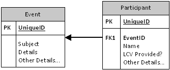

---
authors:
  - serdar

title: "Mini Patterns for XPages: Using Beans for Parent - Child Documents"

slug: mini-patterns-for-xpages-using-beans-for-parent-child-documents

categories:
  - Tips & Tricks

date: 2014-09-01T09:15:00Z

tags:
  - domino-dev
  - xpages
---

After a looong time, I'm blogging XPages again :)

Last time, I was blogging about mini patterns ([this](2011-11-mini-patterns-for-xpages-parameter-editing-with-dialogs-1.md "mini-patterns-for-xpages-parameter-editing-with-dialogs-1.htm") and [that](2011-12-mini-patterns-for-xpages-using-dynamic-content-control-2.md "mini-patterns-for-xpages-using-dynamic-content-control-2.htm")). These are partly reusable design patterns for common cases.

Today I'd like to introduce a simple pattern which I have been using in a couple of applications. This is also an example how you get benefits from Managed Beans for specific purposes. Let's start.
<!-- more -->
**Data Model for Parent-Child Documents**

This is a very common case for Domino applications. There is a main document and its child documents having a pointer (mostly the universal id) back to the main document. Such a model is actually a reflection of the 1-N relation in the RDBMS paradigm. In my little sample, I have chosen a quite simple example of Event-Participants.



The pointer, or the common key element is generally selected as the universal ID of the main document. I personally try to create my own unique key all the time to have some flexibility to copy/paste documents between the test and production environments. Inheriting values between parent and child records is another common issue. In the RDBMS paradigm, this is strictly forbidden because of the normalization issue. However in Domino applications, we have been using the 'wrong' design, because Domino views have no capability to join different records from different data sets. On the other hand, since XPages provides more flexible and capable data model, so with a little performance cost, we don't need to duplicate data anymore.

**UI Model for Parent-Child Documents**

Usually, we got used to display parent-child data with an embedded view in classical Domino applications. Because we didn't have any other alternatives. However, in XPages, we have tons of different layout options to present the child data.


No need to say, choosing a right UI design depends on your application. Sometimes a large table would be all you need, or you might need a [card display pattern](http://taylordavidson.com/2014/cards), especially if users are mobile... You would also mix two approaches (List on the left, Details on the right or expandible details within the row, etc.)

Since I'm not a UI expert, I won't get into details of different design patterns here. The crucial part is that **UI model should be assisted with an appropriate back-end controller model** . Let's summarize a short list of common limitations in the former paradigm of Domino applications:

- Child documents should be saved to be listed on the screen (Views cannot display in-memory documents).
- You shouldn't create a child document without saving the parent first. Because if the user create and bind child documents and skip saving the parent, there will be orphan child documents.
- Embedded Views are only options to display child documents. If you need sorting/filtering, additional views will be needed.
- You can't define a specific action on a specific child (e.g. the best effort would be allowing user to select some child documents and apply a specific action).
- Actions on child documents runs within NotesUIView context, therefore interaction with the parent document is limited (e.g. you need to do some hacks through notes.ini parameters).
- Lots of performance issues in views. Although views are cached, large datasets with reader fields will be slower. Users will also experience additional network usage on Notes clients.
- Many more...

**Example for Parent-Child Document Controller**

Our example database is [on github](https://github.com/sbasegmez/Blogged/tree/master/MainChild)...

It's a minimally-designed, quick and dirty database, just to illustrate a mini pattern here. I have imported some contact data from David Leedy's [Fake Names Demo](http://xpagescheatsheet.com/cheatsheet.nsf/home.xsp).

The scenerio is basic. We create an event, add some participants from the fake name pool. Some visual markings represent several states for participants:


Under the cover, application is using a Managed Bean to handle the list of participants. **ParticipantList** stores in-memory list for **Participant** objects. It performs all data operations (e.g. load the participant list for an event document, save participants, etc.) and list operations (e.g. add/remove/sort/etc.). Participant objects are self-contained. They keep track of selection/deletion status and other data about themselves.

When the participant list called for the first time (via **plist.list** data binding), it prepares the _list object within the managed bean.

```java
// From ParticipantList class...
public List<Participant> getList() {
  if(_list==null) {
    _list=new ArrayList<Participant>();
    DominoDocument dominoDoc=getDominoDoc();

    try {
      if(dominoDoc.isNewNote()) {
        // It will be empty on a new document
      } else {
        loadList(getEventCode());
      }
    } catch (NotesException e) {
      // Use http://www.openntf.org Domino API to get rid of this.
      e.printStackTrace();
    }
  }

  return _list;
}

private void loadList(String eventCode) {
  Database db=ExtLibUtil.getCurrentDatabase();

  View view=null;
  ViewEntryCollection entries=null;

  try {
    view=db.getView("ParticipantsByEventCode");
    entries=view.getAllEntriesByKey(eventCode, true);

    ViewEntry ve=entries.getFirstEntry();

    while(ve!=null) {
      Document pDoc=null;

      try {
        pDoc=ve.getDocument();
        _list.add(new Participant(pDoc));
      } finally {
        Utils.recycleObject(pDoc);
      }

      ViewEntry tmpEntry=ve;
      ve=entries.getNextEntry(tmpEntry);
      Utils.recycleObject(tmpEntry);
    }
  } catch (NotesException e) {
    // Use http://www.openntf.org Domino API to get rid of this.
    e.printStackTrace();
  } finally {
    Utils.recycleObjects(view, entries);
  }
}
```

<br />

The saveParticipants() method into the *postSaveDocument* event of the parent document source.

```java
// From ParticipantList class...
public void saveParticipants() {
  try {
    Iterator<Participant> iterator=_list.iterator();
    
    while(iterator.hasNext()) {
      Participant p=iterator.next();

      p.saveToDb(ExtLibUtil.getCurrentDatabase());

      if(p.isDeleted()) {
        iterator.remove();
      }
    }

  } catch (NotesException e) {
    // Use http://www.openntf.org Domino API to get rid of this.
    e.printStackTrace();
  }
}
```

Here, the data layer is also embedded within the Participant class. it loads and saves itself from/to a participant document. The class design decides what to do on I/O operations.

Once you build such a basic structure, it gets really easy to add more functionality. For instance in the example, I have not implemented a duplicate check. It's just a line of code thanks to Java capabilities. Also sorting is not being saved which can be handled in the load/save life cycle of the child document. List container would track the changes in child documents so it can skip saving of unchanged documents, etc.

One more opportunity is adding additional in-place actions that make changes in the child data. I have added LCV status as an example. You may select some participants and toggle their LCV status.

```java
// From ParticipantList class...
public void toggleLcv() {
  for(Participant p:_list) {
    if(p.isSelected()) {
      p.toggleLcv();
      p.setSelected(false);
    }
  }
}
```

<br />

Since the child object is a seperate bean, all business logic related to the child data can be placed inside the bean. The backing-bean unites all data you have into a single stateful entity. If your document is not saved yet, your child documents are unsaved as well. Just like a multivalue field, you have the total control of everything in a single design.

This can be implemented in a business card format with a profile picture and additional details can be included. One of applications I have designed is a Training application, where attendees are imported from HR database. I have used additional visual indicator shown inside the red rectangle. This person has no e-mail address, so another person should be selected to make contact to him/her. Otherwise, user cannot proceed with saving.


To sum up, this model provides several opportunities

- One bean rules all of your child-data. You don't need to worry about the life cycle as long as you bind correct methods to right points.
- All child data is contained within a bean (Participant objects in this example). They can handle their own states and business logic.
- Thanks to Java Collection Framework, you can perform all kinds of collection operations in the speed of light. You might sort or filter records without additional memory consumption.
- List container can handle all controller functionality, such as validation, import/export records etc.
- You have full control over I/O operations. A new document is a new document with an empty list of child records. An existing parent document loads its own list of child documents and save modified state of the list when saved.
- In memory documents can hold joined data. As an example, if you show a customer and their orders, you shouldn't store product information. Only product id will be enough. During the list aggregation, you might import additional data from other datasets just to include into the presentation.

To create a more reusable codebase is possible. For instance, if you define a child document interface and create an abstract Java class from the interface, you might reuse this child object structure for many different types of parent-child objects.

I'm looking forward to your feedbacks. Have fun :)
