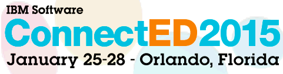

---
authors:
  - serdar

title: "The time for the #IBMConnectED..."

slug: the-time-for-the-ibmconnected...

categories:
  - Conferences

date: 2015-01-22T09:42:21+02:00

tags:
  - openntf
  - ibm-events
---

It's January again. After a long journey from the other side of the world, I'll be there for the fourth time. Really excited to see many friends again...
<!-- more -->

This might be the last "Orlando" conference for most of us. It will be shorter and seems to be less crowded this year. But I'm sure, there won't be empty table at Big River on saturday and Kimonos throughout all week.

I will arrive around friday midnight. Let me know if you need a ride. BALD (Bloggers and friends Annual Lotusphere Dinner) will be my first stop on saturday and I will follow the crowd :)

Many people blogged for newbies with recommendations about what to do. Not to repeat the same stuff, I want to give a very basic advice to all. Such conferences are not technical events alone. I have seen many people leaving the facility at 6 pm. Don't do that. The real conference starts after this time. Don't be shy and participate in the conversation.

Finally, some key events you don't want to miss:

**#IBMNotes25**

OpenNTF, IBM Champions and SocialBizUG will have an unofficial celebration of 25 years of Lotus Notes is on Monday evening from 7:30 -- 8:30 on Swan Crescent Terrace. [More information](http://openntf.org/main.nsf/blog.xsp?permaLink=CGUN-9SWM7Q)...

**CHALK101 Bring Your Application to the Next Level with Open Source Software from OpenNTF**

It's a bit early but who will sleep anyway :)

Tuesday morning between 7:00am - 7:45am [OpenNTF](http://www.openntf.org "OpenNTF") board members will be at Swan 1-2...

**LinuxFest**

On wednesday, just after the Closing General Session, follow the crowd to the Swan Poolside Bar. Bill Malchisky, Wes Morgan, and Daniel Nashed will speak about Linux for ICS professionals. You can find more information [here](http://www.billmal.com/billmal/billmal.nsf/dx/linuxfestvi.htm).

Also visit [OpenNTF blog](http://openntf.org/main.nsf/blog.xsp?permaLink=PWIS-9SVVKV) about some key sessions from [OpenNTF](http://www.openntf.org "OpenNTF") board members.

Have fun and see you there!
