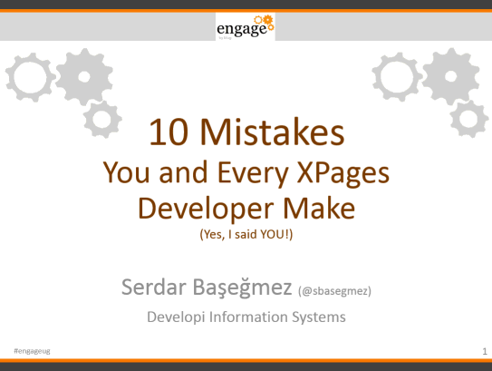

---
authors:
  - serdar

title: "Ready for Engage 2015?"

slug: ready-for-engage-2015

categories:
  - Conferences

date: 2015-03-27T00:10:40+02:00

tags:
  - domino-dev
  - java
  - speaking
  - xpages
  - user-groups
---

This is going to be my first Engage/BLUG next week! So excited to see many friends!

I am also honored to be accepted for [speaking](http://engage.ug/engage.nsf/Pages/Event20150330_Agenda2) at Engage 2015. Here are details on my session...

<!-- more -->
**DEV12. 10 Mistakes You and Every XPages Developer Make. Yes, I said YOU!**
Tuesday, 14:45 - 15:30, Room: D

> A classic learning curve for any new development paradigm involves certain tipping points. After tutorials, documentation, samples and other resources, developers experience a long period of challenges before they feel comfortable with what they use. Developing for XPages is no exception. Sometimes, it takes hours to make even a simple dialog work like you want and you find yourself copying and pasting code fragments that you don't really understand.
> The purpose of this session is to provide a strong understanding of the fundamental principles of basic XPages mechanisms. Between the beginner level and knowing everything going on under the covers, we will provide a different look into the XPages paradigm, discussing common pain points including misunderstanding the browser-server interaction, partial execution/refreshes, JSF phases, SSJS, managed bean issues and user security with code samples and best practices for your development experience.

 

See you soon!
