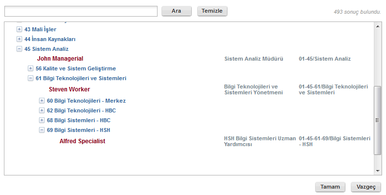
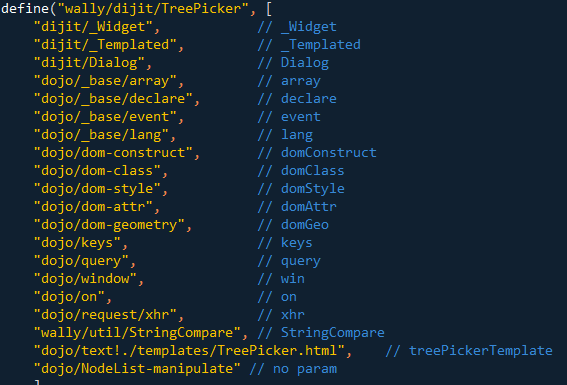
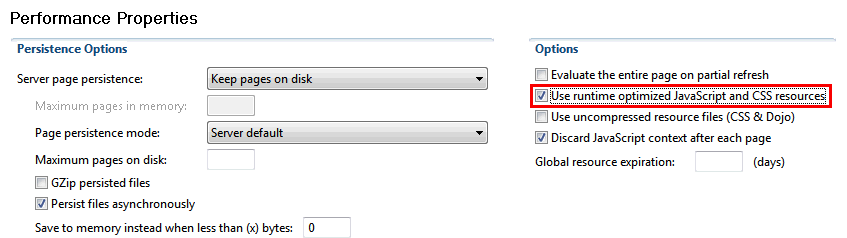
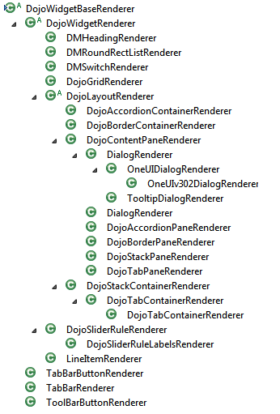
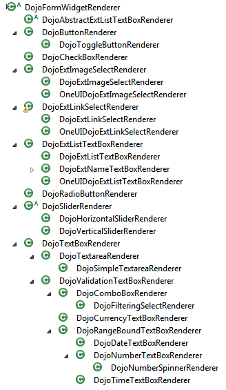

---
authors:
  - serdar

title: "XPages Performance: Dojo Widgets and Resource Aggregation"

slug: xpages-performance-dojo-widgets-and-resource-aggregation

categories:
  - Tips & Tricks

date: 2015-05-28T12:00:00+02:00

tags:
  - best-practices
  - dojo
  - domino-dev
  - performance
  - troubleshooting
---

This time, I skip the "...after a loooong time..." and "...sorry for not blogging frequently..." stuff, and directly jumping into the topic :)

Lately, I have been working on developing my own extension library for different applications on a client. I started with putting a couple of Java libraries, utility objects and managed beans, but it evolved into a very cool project. I want to talk about it, but not now. Today, we will talk about a boring topic, Dojo.

In my plugin, I had one problem to solve. For my client, we have developed a set of databases that holds several different type of records about the internal processes. For more than 10 years, users get used to use specific UI patterns for these structures and some habits cannot be broken easily :)
<!-- more -->
For instance, there is the entire organization structure in different hierarchical ways. When any application needs a selection of a department or a person, we use a PickListCollection on Notes. There are several categorized views for different purposes and the user needs to see the hierarchy between departments and persons to make the right selection.

When I say "Categorized View", I can hear you made a \*sigh\* :)

On XPages, categorized view is a PIA... Worse, if the user has to select something from a categorized view, it means a 'view' in a 'dialog', right? That's the most terrible UX scenario I guess :)

So I decided to design a widget specific to this purpose. I want to blog about this widget in a much broader detail, but for another post. Today, it's about performance.

After so many days, I have developed a component and a Dojo widget specifically for this purpose. It basically extends Dialog component and uses a Tree-Node data structure on the server side. I was pretty concerned about the server side performance, but after a couple of optimization I had a great result. My component takes 650 entries into a Tree in 1 second. After caching, Ajax request is just 80 milliseconds on average. To test my loading indicator, I had to put a "Thread.sleep" inside my code :)



However, during testing I have experienced a very big performance problem on the client-side. The first time when the dialog box loaded, it takes around 5-7 seconds. If we don't use browser caching, it can be double or triple! The reason was of course Dojo and the way it loads widgets.



Dojo use Asynchronous module definition (AMD) technique since 1.7. It's a great pattern for using large frameworks like Dojo. Basically, using AMD, you don't worry about what to load or what not to load. If you want to use dojo/query module, you just declare it at the start of your code and Dojo loads the necessary JavaScript file when needed. However, in some cases, it creates another bottleneck. As shown above, My widget uses 20 different modules, those modules need other modules and so on. When I need to create my widget, it loads up 80 modules in total. Even the browser caches every little JavaScript file, it goes to the server and ask if it has been modified or not. So when the user clicks a link, s/he has to wait at least 5-6 seconds for loading all necessary modules. That's not acceptable from UX point of view.

In XPages, the solution came with the "**Runtime optimized JavaScript and CSS resources** " option in 8.5.3. Let's explain what it is and how it works.



XSP engine has different artifacts for loading JavaScript and CSS modules. You can provide a resource file (CSS, JS or a Dojo Module) from an XPages application or a Plugin. Basically, a '*Runtime Optimized Resource* ' is one giant file combined of all resources needed. If you are going to load 20 different JavaScript files, minifier collects them all and provide one file from a single URL. The download size is the same, but browser makes only one connection for 20 files. The performance gain is great at this point.

For plugins, there are resource loaders. Plugins provide short id's for resources. XSP engine maintains a Library for minifier. Each time it gets a request, it passes the library to all registered ResourceLoader's and they put what they have into the library. If it can find the resource, it can aggregate it in a single file. XPages maintains a core ResourceLoader in the darkness. Extension Library provides an additional ResourceLoader for all "extlib.\*" resources.

For XPages applications, resources are collected at the page rendering phase and minified by the parent component, ViewRoot. Throughout all phases, this component accumulates a list of resources to be loaded in the next "Rendering" phase. They might be coming from XPage markups (*xp:this.resources* tag), or added by components you are using. For instance when you add a Dialog component into your page, Dialog renderer (a special Java class responsible to generate HTML markups for displaying the components) adds resources it will need into the ViewRoot.

If you have enabled aggregator for your XPages application, the render phase will initiate minifier to prepare resources. You can check "Use runtime optimized JavaScript and CSS resources" option in the above dialog (it will add 'xsp.resources.aggregate=true' option to the xsp.properties file). You can also change this behavior by several other options. For instance "**xsp.resources.aggregate.appcss=false** " option will prevent CSS file aggregation. This can be very useful, especially if you are having trouble with CSS containing relative URL's for fonts or images.

Here are the list of all options to tweak this behavior:

```
xsp.resources.aggregate : Should be true to enable minifier.
xsp.resources.aggregate.dojo : If false, Dojo resources will not be aggregated.
xsp.resources.aggregate.css : If false, CSS resources (components and plugins) will not be aggregated.
xsp.resources.aggregate.appjs : If false, JavaScript files of XPage or Theme will not be aggregated.
xsp.resources.aggregate.appcss : If false, CSS files of XPage or Theme will not be aggregated.
```

<br />

Now we know that minifier provides a great performance gain. But there is the special case for Dojo. There is no 'One .JS file for everything' in Dojo. Also, XSP doesn't really know which modules will be needed because Dojo uses AMD, right?

Here, XPages solve this problem very well. When XPages aggregate resources, it collects all resources into a single file. But while it reads those files, it also analyzes them. For instance, it changes relative paths in CSS files. For Dojo modules the minifier detects all "require" declarations and add those files into the resource pool. Therefore, AMD doesn't need to load Dojo modules at the runtime.

Now, there is one trick: All these processes happens only once, when you load the page for the first time. Subsequent requests (partial refreshes) will not generate aggregated files. What does it mean? Consider such a scenario:

```
<?xml version="1.0" encoding="UTF-8"?>
<xp:view
    xmlns:xp="http://www.ibm.com/xsp/core"
    xmlns:xe="http://www.ibm.com/xsp/coreex">
    <xp:button
            value="Show"
            id="button1">
            <xp:eventHandler
                    event="onclick"
                    submit="true"
                    refreshMode="partial" refreshId="myDiv">
                    <xp:this.action><![CDATA[#{javascript:viewScope.showIt=true}]]></xp:this.action>
            </xp:eventHandler>
    </xp:button>
    <xp:br></xp:br>
    <xp:div id="myDiv">
            <xp:div id="innerDiv" rendered="#{viewScope.showIt || false}">
                    <xe:djComboBox id="djComboBox1"></xe:djComboBox>
                    <xe:djCurrencyTextBox id="djCurrencyTextBox1"></xe:djCurrencyTextBox>
                    <xe:djextListTextBox id="djextListTextBox1"></xe:djextListTextBox>
            </xp:div>
    </xp:div>
</xp:view>
```

<br />

Resource aggregation is enabled. There is a simple button and a simple div. Inside the div, I have added three simple dojo components. The button controls if the inner div should be rendered or not. Initially, since dojo components will not be rendered, they will not preload their Dojo modules. But when I click the button, it takes 5-8 seconds to show the dojo components in a local server. There are 50 JS files to be loaded at this point. Since XSP engine doesn't render hidden components, it won't be aware of resources to be loaded at the initial rendering phase.

On partial refreshes, Minifier will not work, therefore, AMD will take care of the module loading. In such a case, Dojo will initiate Ajax requests per each "require" declaration in these Dojo components. Imagine, there might be 10 different types of fields in this page and no users will wait 10-20 seconds to render any page.

What can be done in such a scenario?

Unfortunately, there is nothing much to do in such a scenario. Some components such as Dialog already loads itself and stay hidden. However almost all Dojo components stays unloaded if they are not rendered.



It would be pretty ugly solution but you can always preload Dojo modules manually. For the above example,

```
       <xp:this.resources>
             <xp:dojoModule name="dijit.form.ComboBox"></xp:dojoModule>
             <xp:dojoModule name="dijit.form.CurrencyTextBox"></xp:dojoModule>
             <xp:dojoModule name="extlib.dijit.ListTextBox"></xp:dojoModule>
     </xp:this.resources>
```

<br />

This will preload dojo modules whether they are rendered or not. However, you have to be careful, because the Renderer might change with the theme. Some of these components have separate renderers for Bootstrap or OneUI 3.02. To find which modules or files are requested by components, you can use the following snippet:

```
<xp:this.afterRenderResponse><![CDATA[#{javascript:print(@Implode(view.getEncodeResources(), "\n"))}]]></xp:this.afterRenderResponse>
```

<br />

It's also possible to develop a preloader engine but the problem is that you can't detect default Dojo modules to be loaded by usual Java. Dojo Modules inside the Renderer are declared on a protected method, where you can't access it with traditional techniques. ***This would be another "Dear IBM" suggestion*** :)

As a conclusion: Resource Aggregation is a great facility to increase client-side performance, especially on Dojo-rich applications. As an XPages developer, you should be aware of a bunch of situations where XSP engine does not minify resources. Partial refresh scenario is a common scenario. If you also deliver custom Dojo widgets or use AMD to write Dojo code, remember to preload base Dojo modules through 'xp:this.resources' markup.
