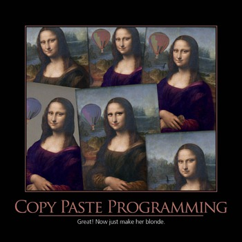
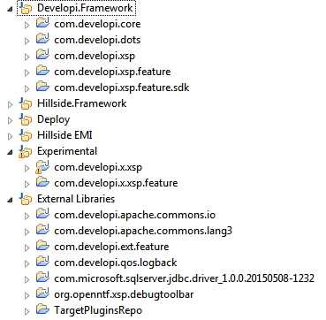
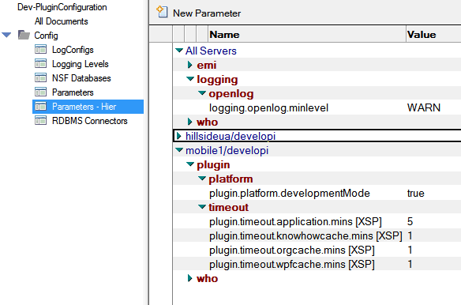

---
authors:
  - serdar

title: "I have my own extension library..."

slug: i-have-my-own-extension-library...

categories:
  - Articles

date: 2015-06-22T11:30:00+02:00

tags:
  - domino-dev
  - java
  - plugins
  - xpages
---

6 months ago, I accepted my problem. As many developers, I was working on several different XPages projects in different times. Using a couple of Java classes over and over again. Each time I add a new method/modify an existing one, I was copying and pasting code between several applications. Versioning was a nightmare.
<!-- more -->

One day, I decided to solve this. I was going to create a JAR file for all my utility classes and share that among several projects. Started coding on Eclipse. I don't remember how; but I ended up with more than 40K lines of code spanned on 6 plugins now.

This is the story of how I designed my own extension library :)

The whole design is a great example of non-structured iterative development for me. As I said, I started coding to have one simple JAR file. Things got out of control (!) in time but I can still tell lies about how I have planned for the structure, did some paperwork on the architecture, created an interface first and written an implementation later. I can even fabricate a funny name for the development approach I have used. But I won't :)

Truth is, this might be the most disorganized project I had. For instance, I have rewritten the configuration module 4 times or the logging module 6 times. That's why I decided to blog about it and I will also open source some parts of the library in time. (Why later? Because it's mixed with the client code now.)

Briefly, my problem is complicated. I'm designing a bunch of XPages applications running on different servers. Some of those have DOTS components as well. Now, a new API design involved in a project. We are looking into Wink servlets for this approach. This multiple platform paradigm becomes an issue at some points. Logging is a great example.

First, I have rewritten the [OpenLog implementation](http://www.openntf.org/main.nsf/project.xsp?r=project/XPages%20OpenLog%20Logger) of [Paul S.Withers](http://www.intec.co.uk/blog/) for my XPages applications. But when I wanted to use the same implementation for a DOTS tasklet, I had a great problem. Because committing a log action needs a Session object and you can only have one temporary Session object, available only in the tasklet. Passing the Session around classes end up with a difficult implementation. After a few iteration, I also found out that using OpenLog as the sole logging mechanism was not practical in many ways. So I decided to follow ODA (OpenNTF Domino API) team and changed the logging mechanism into more Java way. But with one difference: I have integrated [Logback](http://logback.qos.ch/) into my plugin. Then designed an OpenLogAppender to log specific events only. I solved the Session problem with a way more complicated method but I'll come to that.

At some point, I have decided to split the whole project into different plugins in this direction:

- External Library plugins: One plugin for each external library I need, such as Apache Commons, Logback, JDBC wrappers, etc.
- com.developi.core : Core classes that have no dependencies other than J2SE and Domino
- com.developi.xsp: Platform specific classes with dependencies to the XSP engine, ExtLib and similar stuff.
- com.developi.dots: DOTS-specific classes with no dependencies other than J2SE, DOTS and Domino.

- Client plugins like com.client1.core, com.client1.xsp, etc.: The same logic, but specific client classes

One big problem was configuration handling among databases. Normally, I use the same principle for each XPages app: A view for configuration documents and a managed bean to hold all configuration data. For plugin approach, I switched to a separate database model. Designed a generic database that can store different configuration objects. So I can store server-specific or application specific settings on a centralized database. At the Java side, I can store this information on a singleton object so all different applications or components can access the configuration data when they need.

At this point I got a challange. I need to update the configuration on the server when it changes. It would be easy if we were talking about just one server but many applications are working on multiple servers. Also it wasn't only the configuration. I was using the same principle for caching application-specific data. For instance, my client has an extensive integration with the Organization module in their environment. Lots of information from the organization database and business processes are cached on several objects to be used across applications.

At this point, I decided to design a central task for XSP engine. I learnt this very useful [HttpService](https://stash.openntf.org/projects/ODA/repos/dominoapi/browse/org.openntf.domino.xsp/src/org/openntf/domino/xsp/adapter/OpenntfHttpService.java) from the great [OpenNTF Domino API](http://openntf.org/main.nsf/project.xsp?r=project/OpenNTF%20Domino%20API) project. My service implementation basically reloads all registered objects at specific times. It has also some initialization tasks on the server start and I'm planning to use it more effectively in the future because it's the entry point for almost all requests coming into the XSP engine.

Configuration handler has also different goodies. For instance, it can also store Log configuration and configuration handler can change the logging on-the-fly. That was particularly important for my environment to debug problems on the production without any intervention on any application.

Since I have created an extension library, it was also pretty easy to adapt new components. I have started with a treepicker component that allows the user to select document(s) from categorized views.

Meanwhile, we have experienced some shortcomings in Extension Library. One of them was the relational database access from XPages. As you may know configuration for JDBC connections comes from XML files defined in you database and they are static. You can't change the username/password on runtime. You might define your own connection in the runtime but in that case, you lose the connection pooling feature.

If you design your own library, it's easy to extend a standard functionality. I did so and created a custom provider for JDBC connections, supporting connection pools and dynamic configuration. This part is in progress now and when I'm done, I'll submit it back into the ExtLib code stream. So far, it works like a charm for specific cases.

In the upcoming blog posts, I will talk about some best practices around development and production environment setup. Right now I'm in progress of clearing packages and separating client codes from mine. Therefore I can open some parts of the plugin and contribute into other projects like ExtLib or ODA (OpenNTF Domino API).

You don't want to wait and start coding your own library today? Start with a simple plugin and explore Extlib and ODA source code. I have learnt a lot of stuff from both projects.

P.S. I should give credits for our dear friend Tim Tripcony about it. I can't forget our chat about "having different extension libraries for different needs" from a conference years ago.

#codefortim
