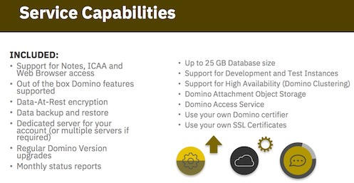
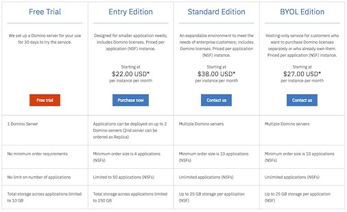
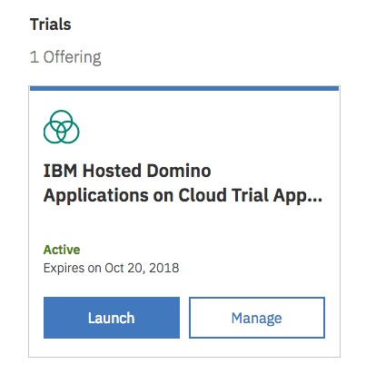
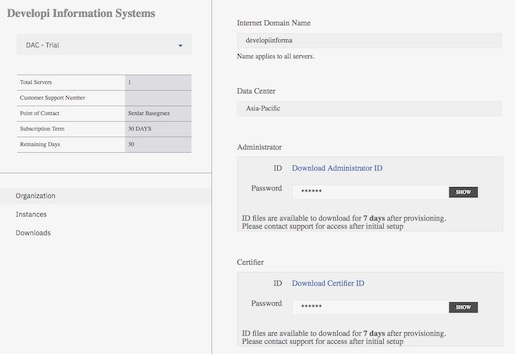

---
authors:
  - serdar

title: "IBM Domino Apps on Cloud: Getting Started..."

slug: ibm-domino-apps-on-cloud-getting-started...

categories:
  - Articles

date: 2018-09-20T15:50:32+03:00

tags:
  - cloud
  - domino-admin
  - ibm
---

Finally, it's here... We've been waiting for this for a long time.

IBM now offers Domino Apps on Cloud (DAC) for customers requiring a server in the cloud.
<!-- more -->
I don't want to talk much about the cost of ownership or other financial/organizational advantages around this service. Your IBM representative will provide the necessary sales pitch. But as a simple example, I am spending dozens of precious billable hours to maintain my production and development servers on virtual and/or bare metal servers. So it's absolutely worth paying for a cloud environment where my Domino server just works... Of course, still, this is a new product and we will see the performance and the flexibility.

At first, I was also concerned that DAC will be so restricted (like XSP in Bluemix) that we will have lots of difficulties to get easiest things done. But it wasn't. On the contrary, it was above my expectations. IBM provisions a brand new Domino server in minutes, that can be accessed through the Administrator client to make changes. The service is capable enough to hold your enterprise applications with great confidence.

Just to put it into the right place; by this offering, IBM only provides a provisioned Domino server on Docker. They monitor, backup, upgrade, etc. But the databases are yours and YOU have to manage them.

There are basically [three types of editions](https://www.ibm.com/us-en/marketplace/domino-applications-on-cloud/purchase) right now: Entry, Standard and BYOL (Bring your own license). The entry edition costs much less (minimum 88 USD / month for 4 NSFs) but limited in capacity and the server count. The difference between Standard and BYOL is just licensing. [The marketplace page](https://www.ibm.com/us-en/marketplace/domino-applications-on-cloud/) included FAQs and various webcasts. Also bear in mind, 1 year commitment needed and there are cluster and dev/test servers in different pricing (and yes, pricing can be complex!)

Anyway, let's get the engineer back and show how to get started with your first server... We can have a free trial, as you see and I decided to have one today. Go to [this page](https://www.ibm.com/us-en/marketplace/domino-applications-on-cloud/purchase), login with an IBM Id and click to the **Free trial** link. It takes a couple of minutes to provision your new server. I first expected that it will appear in my IBM Cloud dashboard but it's in the [My IBM dashboard](https://myibm.ibm.com/dashboard/).

So we can Launch DAC Console, or Manage our plan. Remember, our server is up and running. What we need to reach our new server is in the DAC Console.

From the console, we learn the domain name, server address (in the instances section) and ID file passwords (ID files are going to be downloaded from here). Of course it's not practical to use them. First thing first, I have certified my own organization and added my own ID as an administrator. Also, it's possible to create this new server with your own certifier, so you can have additional server on the cloud as an hybrid model.

I have connected to the server by switching ID on my Notes and used admin client to set up my own organization. One hint here; the server has an host name but it's different from the server name. So it's better to have a new connection document on local names.nsf to connect. My host name was "*developiinforma-apps01.isscdac.net* " and domino server was "*apps01/developiinforma* ".

Your server is up and running now. You can access it through your Notes client and you can administrate the server as you wish (It lacks of documentation right now, so we don't know if there is a contractual limit or not). My trial server is "Release 9.0.1FP9HF175", so it's probably an internal version slightly above IF2. You can trust your own server and have a replication at this point. You may also replicate a directory catalog and have a directory assistance for your users.

I will play with my new toy a little bit further. I might blog more about my experiences in the future.
