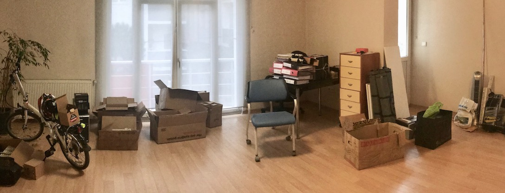

---
authors:
  - serdar

title: "A New Life Ahead"

slug: a-new-life-ahead

categories:
  - Misc

date: 2019-01-04T12:02:28Z

tags:
  - blogging
  - personal-news
---

In 2003, I left my job and started looking for a better one. I wasn't quite happy working for a corporation and I wasn't the employee of the month either. However, after a series of coincidences, I end up with a brand new laptop waiting for a long bus ride to a resort near the Mediterranean Sea.
<!-- more -->
That was my first freelance project. As you might guess, I liked it a lot. I have signed contracts with my former employers, created the Developi brand, worked with extraordinary people and added new customers, products, and projects to my portfolio.

After 15 years, over 10 thousand hours of services for more than 20 customers from all over the world, and of course hundreds of server upgrades there needs to be a change.

So, there will be changes.

**In a couple of months, we start a new life with my family in the United Kingdom. I will continue my own business\* with my new company** **[Developi UK](http://www.developi.co.uk/).**

We have not decided the destination yet, which might be anywhere between Wales and Scotland. Anyhow, I will be in London for a couple of months after February.

Hope to see some friends in the UK soon...

***This is my office these days...***

 

\* *At least for six more years, as I promised to UKVI... #Developi2025* 😄
