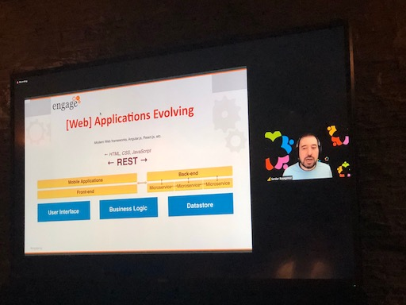

---
authors:
  - serdar

title: "From Engage 2020: Design a RESTful API for your Domino Apps"

slug: from-engage-2020-design-a-restful-api-for-your-domino-apps

categories:
  - Conferences

date: 2020-03-04T12:40:00Z

tags:
  - domino-dev
  - rest-apis
  - slidedeck
  - speaking
  - user-groups
---

Today, during my session, I remembered I had a blog and my last update was the last year, again for sharing a slide deck :)

So, here it comes... Yet another slide deck on my blog...
<!-- more -->
First, I'd like to thank to the Lifetime IBM Champion and HCL Grandmaster [Theo Heselmans](https://twitter.com/theoheselmans) once more. This year started really tough, especially with the onset of a terrible Coronavirus outbreak. I am really happy to see everything went well so far with the greatest user group conference in Europe.

Unfortunately I could not attend the Engage conference this time. I had to renew my residency card and somehow, it has not arrived on time (Brexit???) and I had to cancel my trip at the last minute. However, thanks to [Heiko Voigt](https://twitter.com/HeikoVoigt3), I could present my session remotely.

Thanks to [Paul Harrison](https://twitter.com/PaulHarrison) for his [photo](https://twitter.com/PaulHarrison/status/1235103958080741377).

This session is an extended version from the last year. I wanted to emphasize more on the design topic, so I included a part where I have discussed the design-first approach, tools to use designing RESTful APIs and how we can architect our RESTful applications in Domino environments.

I had no time for a demo and also remote demo would be quite difficult to follow for the audience. So I skipped the demo part. However, I find the idea to have an example application and put that into RESTful architecture quite attractive. I hope I can find some time to do this.

So, here is the slide deck from my session today...

