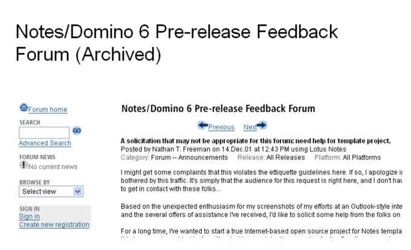
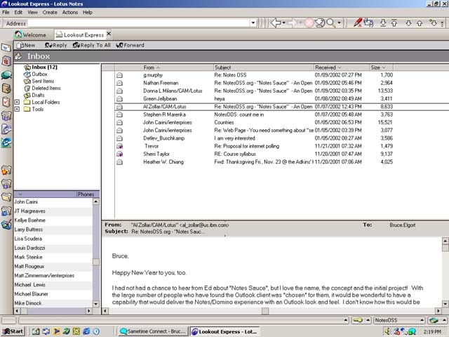
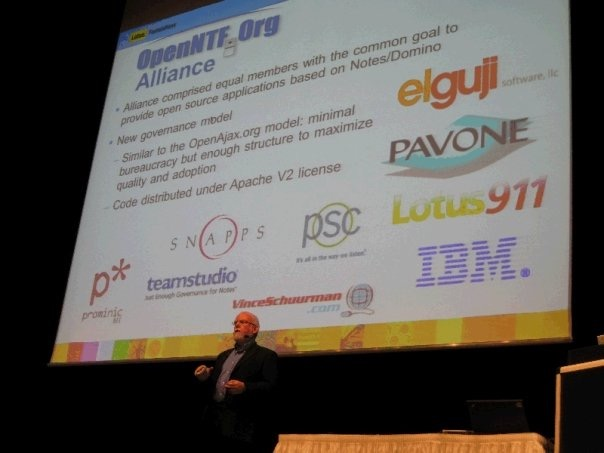

---
authors:
  - serdar

title: "Celebrating OpenNTF's 20th Anniversary..."

slug: celebrating-openntfs-20th-anniversary...

categories:
  - OpenNTF

date: 2021-12-14T13:38:00Z

tags:
  - community
  - openntf
---

Today, it has been exactly 20 years, since Nathan T. Freeman posted the following idea on a Notes.net forum:
<!-- more -->

Nathan created his own mail template with "the Outlook Express look" and he got offers of assistance from other people. His suggestion was a community site to share open source projects.

It was possibly one of those ideas to be forgotten for good, until Bruce Elgort offered help to realize it. Bruce donated a Dell server which was hosted at his office (Sharp) and they launched the **NotesOSS.org** , also known as "**Notes Sauce**". "Notes" name became a possible patent issue later and the group changed to "OpenNTF" as we know it today.

There wasn't a single purpose behind OpenNTF. People wanted to share code and NotesOSS was providing a concept of open-source project which has a life-cycle with multiple contributors and a continuous interaction loop with its consumers. The productivity around sharing was incomparable in Open source projects. Indeed, one of the first projects proved this point. [OpenNTF](http://www.openntf.org "OpenNTF") needed a killer application to attract more people and 11 developers from around the world developed [OpenNTF](http://www.openntf.org "OpenNTF") Mail Experience. This project was adding significant enhancements to the IBM's mail template like follow-up, Send Again, Mail Flags, etc.

[OpenNTF](http://www.openntf.org "OpenNTF") also provided a space to collaborate developers for alternative solutions. IBM was the sole provider of solutions, but there were many talented developers out there, highly motivated to provide alternatives when they disagree the IBM's way. Crimson was emerged when IBM cancels the Garnet project, [OpenNTF](http://www.openntf.org "OpenNTF") Domino API started based on the fact that IBM was not planning a modern Java API. Nathan put it very well when asked for the mission of the NotesOSS in 14/02/2001:

> The objective is, essentially, to make the Notes/Domino user community less dependent on IBM to create universally applicable solutions, and in so doing, promote the technology as a platform.

Of course, a sole web site wouldn't be enough to facilitate more than 900 projects. [OpenNTF](http://www.openntf.org "OpenNTF") should have evolved into something bigger. In 2009, [OpenNTF](http://www.openntf.org "OpenNTF") Alliance founded by the participation of many companies targeting a way to incorporate [OpenNTF](http://www.openntf.org "OpenNTF") to a new governance model. In 2011, the initiative resulted in today's [OpenNTF](http://www.openntf.org "OpenNTF") Inc.

[OpenNTF](http://www.openntf.org "OpenNTF") Alliance was a controversial move in its time. Individuals were the driving force in OpenNTF. They were the productive ones and for many people, companies (notably IBM) were the friction against the "free spirit". At the same time, individuals were under-represented in the alliance. Alliance might just mean more bureaucracy for developers at the end.

On the other hand, [OpenNTF](http://www.openntf.org "OpenNTF") wasn't even able to sign basic contracts for anything, because of the lack of a legal identity. A governance model was important to convert the momentum into a sustainable organisation and reduce the dependence to individuals. It needed accountability to host properly cleared open source applications to be able to accept contribution from big companies (IBM) and attract larger corporations as consumers.

The alliance created a huge momentum, especially with Niklas Heidloff. He spent so much time for organising [OpenNTF](http://www.openntf.org "OpenNTF") contests, highlighting contributions and coordination with IBM teams for projects like Extension Library. [OpenNTF](http://www.openntf.org "OpenNTF") had a new generation of contributors after the transformation. In five contests, 145 new projects from 117 people (48 first-timers, including me!) contributed. Extension library and Social Business Toolkit were the largest code contributions made to [OpenNTF](http://www.openntf.org "OpenNTF") ever. Last but not the least, there were very complicated community projects like [OpenNTF](http://www.openntf.org "OpenNTF") Domino API, DominoJNA, SmartNSF, [OpenNTF](http://www.openntf.org "OpenNTF") Essentials etc.

Today, [OpenNTF](http://www.openntf.org "OpenNTF") is slowing down, just like many other communities in the yellowverse. There are multiple reasons for that but none of them are for today.

It's time to thank hundreds of contributors donated code to [OpenNTF](http://www.openntf.org "OpenNTF") in the past 20 years. To highlight a few; **Nathan T. Freeman** , **Bruce Elgort** , **Vince Schuurman** , and **Anil Vartak** were driving forces behind the OpenNTF.

Personally, I would also like to thank **Bruce** and **Niklas**, as they involved me and many others to the OpenNTF.

See you at the [OpenNTF 20th Anniversary celebration](https://www.openntf.org/main.nsf/blog.xsp?permaLink=GACS-C8SMKW)...
